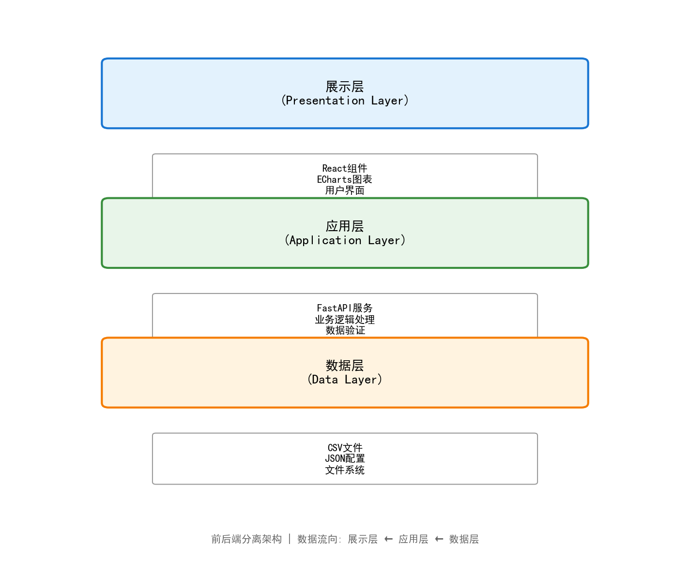

# 论文图片说明

本文件夹包含论文所需的所有图片，使用Python程序自动生成。

## 图片列表

### 第2章 系统需求分析（4张）

1. **图2-1 产业态势感知业务流程图.png**
   - 说明：展示产业态势感知的业务流程（登录→浏览→查看指标→分析图表→识别异常→深入分析→获得洞察）
   - 生成时间：2024-12-30

2. **图2-2 数据处理业务流程图.png**
   - 说明：展示数据采集与处理流程（获取→清洗→标准化→分类→审核→入库→发布）
   - 生成时间：2024-12-30

3. **图2-4 产业数据看板模块功能结构图.png**
   - 说明：展示产业数据看板模块的6大核心功能和24个子功能
   - 生成时间：2024-12-30

4. **图2-5 产业链图谱数据结构图.png**
   - 说明：展示产业链图谱的数据结构（三大数据类型、节点结构、边结构、可视化属性）
   - 生成时间：2024-12-30

### 第3章 系统设计（8张）

5. **图3-1 系统总体架构图.png**
   - 说明：展示三层架构（展示层、应用层、数据层）
   - 文件大小：71KB
   - 生成时间：2024-12-30

6. **图3-2 前端技术架构图.png**
   - 说明：展示前端技术栈（React、Vite、Ant Design、ECharts等）
   - 文件大小：75KB

7. **图3-3 后端技术架构图.png**
   - 说明：展示后端技术栈（FastAPI、Uvicorn、Pandas、Pydantic等）
   - 文件大小：67KB

8. **图3-4 功能模块结构图.png**
   - 说明：展示九大功能模块及其关系
   - 文件大小：68KB

9. **图3-5 数据处理流程图.png**
   - 说明：展示数据处理流程（采集→清洗→转换→验证→存储→加载）
   - 文件大小：46KB

10. **图3-6 API接口时序图.png**
    - 说明：展示前后端交互时序
    - 文件大小：45KB

11. **图3-7 区域-产业矩阵热力图示例.png**
    - 说明：展示区域与产业交叉分布热力图
    - 文件大小：73KB

12. **图3-8 双模界面样式对比图.png**
    - 说明：对比V1管理模式和V2体验模式
    - 文件大小：51KB

### 第4章 系统实现（2张）

13. **图4-5 双模界面切换流程图.png**
    - 说明：展示模式切换的完整流程
    - 文件大小：78KB

14. **图4-6 图表联动筛选时序图.png**
    - 说明：展示图表联动的交互流程
    - 文件大小：63KB

### 第5章 系统测试（3张）

15. **图5-1 功能测试用例执行结果图.png**
    - 说明：展示功能测试统计结果（44个用例，100%通过）
    - 文件大小：65KB

16. **图5-2 响应时间测试结果折线图.png**
    - 说明：展示各测试项的响应时间与性能阈值对比
    - 文件大小：106KB

17. **图5-3 并发性能测试结果图.png**
    - 说明：展示并发性能测试结果（响应时间和吞吐量）
    - 文件大小：70KB

## 如何使用

### 在论文中引用图片

在Markdown论文中使用以下格式引用图片：

```markdown
【图3-1 系统总体架构图】



如图3-1所示，系统采用三层架构设计...
```

或在Word文档中：
1. 点击"插入" → "图片"
2. 选择对应的图片文件
3. 调整图片大小和位置

### 重新生成图片

如果需要修改或重新生成图片，运行以下命令：

```bash
# 激活虚拟环境
.venv\Scripts\activate

# 运行图片生成程序
python generate_thesis_images.py
```

## 技术栈

图片生成使用以下Python库：

- **matplotlib**：数据可视化，绘制架构图、流程图、统计图
- **numpy**：数值计算
- **pillow**：图像处理

## 图片特点

- **格式**：PNG（无损压缩）
- **分辨率**：150 DPI
- **配色**：专业的配色方案，符合学术论文要求
- **中文支持**：已配置中文字体
- **清晰度**：适合打印和电子版

## 自定义图片

如需修改图片样式，编辑 `generate_thesis_images.py` 文件：

```python
# 修改配色方案
colors = {
    'primary': '#1976D2',
    'secondary': '#4CAF50',
    'accent': '#FF9800'
}

# 修改尺寸
fig, ax = plt.subplots(figsize=(width, height))

# 修改字体
plt.rcParams['font.sans-serif'] = ['SimHei', 'Microsoft YaHei']
```

## 联系方式

如有问题或建议，请联系项目维护人员。

---

**生成日期**：2024年12月30日
**生成工具**：Python 3.13 + Matplotlib 3.10.8
**图片总数**：17张
